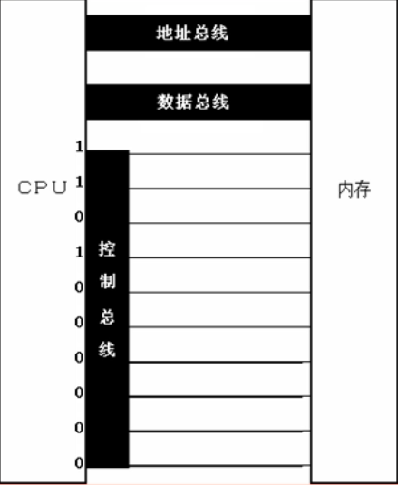
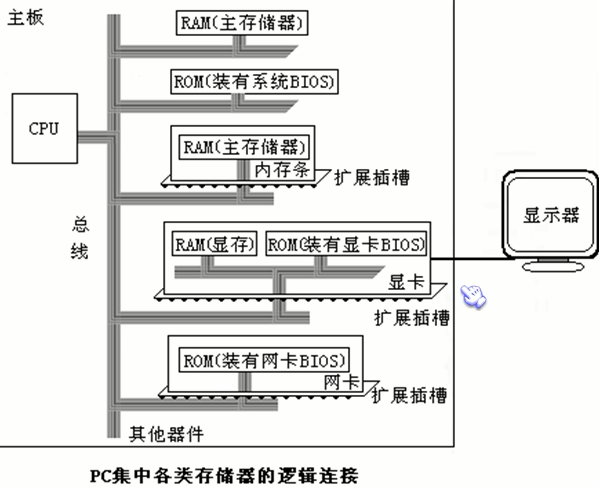
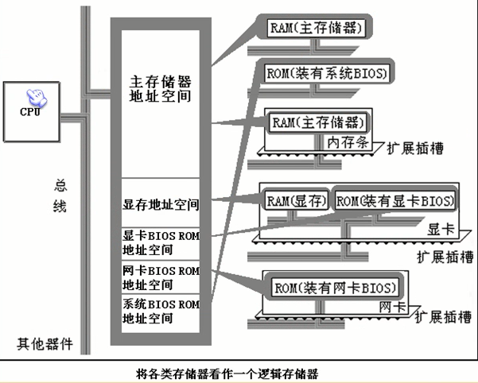
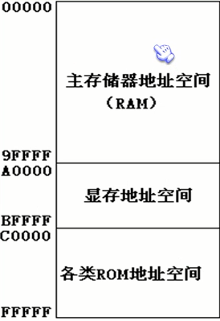
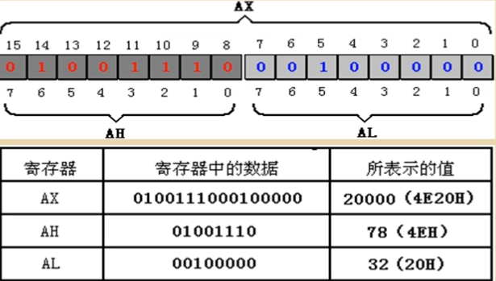

# 汇编语言

> 直接在硬件之上工作的编程语言，首先了解硬件体系结构，才能更有效的应用汇编语言对其编程。与机器语言最接近的计算机语言

## 汇编语言介绍

### 汇编语言特性

- 效率最高
- 开发驱动程序或嵌入式

### 学习汇编的好处

- CPU 和 Mem 如何工作
- 机器思维

### 机器语言

> 机器指令的集合

一台机器上正确执行的**命令**

- 指令
  - `PUSH AX)` 推进堆栈
  - 机器语言`01010000`

- S = 768 + 12288 - 1280
- 机器码：
  - 101100000000000000000011
  - 000001010000000000110000
  - 001011010000000000000101

### 汇编语言的产生

- 汇编语言的主题是**汇编指令**
- 汇编指令是机器指令的**助记符**

- 机器指令： `1000100111011000`
- 操作：寄存器 `BX` 的内容送到 `AX` 中
- 汇编指令：`MOV AX,BX`

### 寄存器

- CPU可以存储数据的器件，一个CPU中有多个寄存器。
- AX 是其中一个寄存器的代号
- BX 是另一个寄存器的代号

- 计算机只能读懂机器指令，那么如何让计算机执行程序员用汇编指令编写的程序？

programmer -> mov ax,bx(汇编指令) -> 编译器 -> 1000100111011000 -> 计算机

``` sh
# gcc -S main.c -o man.s
```

### 汇编语言的组成

1. 汇编指令（机器码的助记符）
2. 伪指令（有编译器执行）
3. 其他符号（有编译器识别）

CPU工作机制：《编码的奥秘》

汇编语言的指令决定了汇编语言的特性

### 存储器

- 控制整个计算机的运作和进行运算，提供**指令和数据**
- 指令和数据在存储器中存取

- 磁盘上的数据或程序读取到内存，CPU从内存里读取数据和程序并运行并发结果返回到内存中

### 指令和数据

- 在内存或磁盘上，指令和数据没有任何区别，都是二进制信息
- 二进制信息
  - `1000 1001 1101 1000` -> `89D8H` (数据)
  - `1000 1001 1101 1000` -> `MOV AX,BX` (程序)

### 存储单元

- 存储器被划分为若干个存储单元，每个存储单元从0开始顺序编号
- 一个存储器有128个存储单元，编号从 0 ~ 127

### CPU对存储器的读写

- CPU进行数据的读写，必须和外部器件进行三类信息的交互
  - 1.存储单元的**地址**（地址信息）
  - 2.器件的选择，读或写**命令**（控制信息）
  - 3.读或写的**数据**（数据信息）

- CPU是通过什么地址、数据和控制信息传到存储芯片中的呢？

- 电子计算机能处理、传输的信息都是电信号，电信号当然要用导线传送

- 专门有连接**CPU**和**其他芯片**的导线，通常称为**总线(bus)**
  - 物理上：一根根导线的集合
  - 逻辑上划分为
    - 地址总线
    - 数据总线
    - 控制总线

- CPP -------地址总线------- 内存
- CPP -------数据总线------- 内存
- CPP -------控制总线------- 内存

- 读的过程：首先通过地址总线发送地址(数据存储的地址)，再通过控制总线发出读指令，在存储器中读方式取地址所在的数据并通过数据总线返回给CPU
- 写的过程：首先通过地址总线发送地址(数据存储的地址)，再通过控制总线发出写指令，CPU通过数据总线发送数据并覆盖地址总线发送的地址所对应的数据

### 地址总线

- CPU是通过地址总线来**指定存储单元**的
- 地址总线上能传送多少个不同的信息，CPU就可以对多少个存储单元进行**寻址**
- 64bit = CPU + OS + Software
- 地址纵向如何发送信息？


地址总线从上到下，低地址(个位)到高地址(高位：千，万)。1101 0000 00 发送到内存，内存自动定位到1101 0000 00地址中。

一个CPU有N根地址总线，则可以说这个CPU的地址总线的宽度为N

这样的CPU最多可以寻找2的N次方个内存单元

1Byte = 8bit

### 数据总线

CPU与内存或其他器件之间的数据传送是通过数据总线来进行的。

**数据总线的宽度**决定了CPU和外界的**数据传送速度**

#### 向内存中写入数据89D8H时，是如何通过数据总线传送数据的

##### 8088CPU数据总线上的数据传送情况 - 8位数据总线上传送的信息


第一次先传送低位D8，再次传送高位89，需要传送二次才能送达到内存。如果每次一秒钟，需要二秒钟才能传完。

##### 8086CPU数据总线上的数据传送情况 - 每次传送16位


一次传送即可

### 控制总线

CPU对外部器件的控制是通过控制总线来进行的。是一些不同控制线的集合。

有多少根控制总线（读或写），就意味着CPU提供了对外部器件的多少种控制。

控制总线的宽度决定了CPU对外部器件的控制能力。



每一条线对应一个控制器件。1: 显示器读写，1：内存读，0...

- 内存读或写命令是由几根控制线综合发出的
  - 其中有一根名为读信号输出控制线负责由CPU向外传送读信号，CPU向该控制线上输出低电平表示将要读取数据；
  - 有一根名为写信号输出控制线负责由CPU向外传送写信号

### 主板

主板有核心器件和一些主要器件

这些器件通过总线（地址总线、数据总线、控制总线）相连

### 接口卡

计算机系统中，所有可用程序控制其工作的设备，必须受到CPU的控制

CPU对外部设备不能直接控制（如：显示器、音响、打印机等）。直接控制这些设备工作的是插在扩展插槽上的接口卡。

### 各类存储器芯片

- 从读写属性上看分为两类：
  - 随机存储器（RAM）和只读存储器（ROM）
- 从功能和连接上分类
  - 随机存储器RAM
  - 装有BIOS的ROM
  - 接口卡上的RAM

### 各类存储器的芯片

- 装有BIOS的ROM
  - BIOS：Basic Input/Output System

- BIOS是由主板和各类接口卡厂商提供的软件系统，可以通过它利用该硬件设备进行最进本的输入输出。在主板和某些接口卡上插有存储相应BIOS的ROM。



### 内存地址空间

> 一个CPU的地址线宽为10，那么可以寻址1024个内存单元，这1024个可寻址到的内存单元就构成这个CPU的内存地址空间

存储器在物理上独立的器件，但逻辑上是相连的

1. 都和CPU的总线相连
2. CPU对他们进行读或写的时候都通过控制线发出内存读写命令



- 所有的物理存储器被看做一个由若干个存储单元组成的逻辑存储器

- 每个物理存储器在这个逻辑存储器中占有一个地址段，即一段地址空间

- CPU在这段地址空间中读写数据，实际上就是在相对应的物理存储器中读写数据。

假设，上图中内存空间地址段分配如下：

- 地址0~7FFFH的32KB空间为**主随机存储器**的地址空间
- 地址8000H~9FFFF的8KB空间为**显存地址空间**
- 地址A000H~FFFFH的24KB空间为各个**ROM的地址空间**



最终运行程序的是CPU，用汇编编程的时候，必须要从**CPU的角度考虑问题**

对于CPU来讲，系统中的所有存储器中的存储单元都处于一个统一的逻辑存储器中，它的容量受CPU寻址能力的限制。这个**逻辑存储器**即是我们所说的内存地址空间。

## 寄存器（CPU工作原理）

### CPU概述

> 运算器、控制器、寄存器等器件组成

- 内部总线实现CPU内部各个器件之间的联系
- 外部总线实现CPU和主板上其他器件的联系

### 寄存器概述

- 8086CPU有14个寄存器
  - AX
  - BX
  - CX
  - DX
  - SI
  - DI
  - SP
  - BP
  - IP
  - CS
  - SS
  - DS
  - ES
  - PSW

### 通用寄存器

> 8086CPU所有的寄存器都是16bit，可以存放两个字节

**AX,BX,CX,DX** 通常用来存放**一般性数据**被称为通用寄存器

16位数据在寄存器中的存放情况

- 数据：18
- 二进制表示：10010
- 在寄存器AX中的存储
- 16bit寄存器所能存放的数据的最大值为 2^16 - 1

- 8086上一代CPU中的寄存器都是8bit的
  - 为了兼容性，这四个寄存器都可以分为两个独立的8位寄存器使用
  - AX可以分为AH(高位)和AL(低位)
  - BX可以分为BH(高位)和BL(低位)
  - CX可以分为CH(高位)和CL(低位)
  - DX可以分为DH(高位)和DL(低位)

- AH和AL寄存器是可以独立使用的8bit寄存器




### 字在寄存器中的存储

一个字可以存在一个16位寄存器中，这个字的高位字节和地位字节自然就存在这个寄存器的高8位寄存器和低8位寄存器中

由于一个内存单元可以存放8位数据，CPU中的寄存器又可以存放n个8位数据。计算机中的数据大多是由1~N个8位数据构成的。

用十六进制来表示数据可以直观的看出这个数据时由哪些8位数据构成的。每两位对应一个八进制。

### 几条汇编指令

| 汇编指令      | 控制CPU完成的操作 | 用高级语言的语法描述 |
| -------       | ---------------- | ------------------ |
| mov ax, 18   | 将18送入AX | AX = 18 |
| mov ah, 78   | 将78送入AH | AH = 78 |

| add ax, 8   | 将寄存器AX中的数值加上8 | AX = AX + 8 |
| mov ax, bx   | 将寄存器BX中的数据送入寄存器AX | AX = BX |
| add ax, bx   | 将AX,BX 中的内容相加，结果存在AX中 | AX = AX + BX |

**汇编指令不区分大小写**

CPU 执行下表中的程序段的每天指令后，对寄存器中的数据进行的改变

程序段中指令执行情况之一（原AX中的值：0000H，原BX中的值：0000H）

| 程序段中的指令 | 指令执行后AX中的数据 | 指令执行后BX中的数据 |
| -------       | ---------------- | ------------------ |
| mov ax, 4E20H   | 4E20H | 0000H |
| add ax, 1406H   | 6226H | 0000H |

| mov bx, 2000H   | 6226H | 2000H |
| add ax, bx   | 8226H | 2000H |
| mov bx, ax   | 8226H | 8226H |
| add ax, bx   | ? | 8226H |

### 物理地址

### 16位结构的CPU

### 8086CPU各处物理地址的方法

### 段地址X16 + + 偏移地址 = 物理地址的本质含义

### 段的概念

### 段寄存器

### CS和IP

### 代码段

